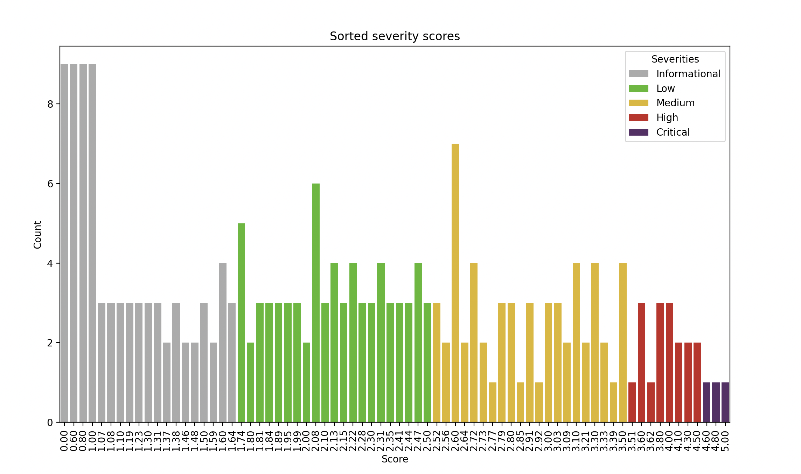

# Hacken OÜ - Severity Formula Standart

## Overview

The Issue Severity Formula is a tool designed to assess the severity of software issues based on four key metrics: Likelihood, Impact, Complexity, and Exploitability. This calculator provides a quantitative measure that helps prioritize and address issues effectively.

## Metrics

### 1. Likelihood

- **Description**: Reflects the probability of the issue occurring.
- **Scale**: 
    1. **[1]** - Very unlikely
    2. **[2]** - Low risk (e.g., exposure of protocol owner's private key)
    3. **[3]** - Medium risk (e.g, conditionally possible but likely to occur)
    4. **[4]** - High risk (e.g, not certain but very likely to occur)
    5. **[5]** - Certain risk
- **Example Scenarios**:
  - **High Likelihood**: Frequent occurrence, easily triggered.
  - **Low Likelihood**: Rare events, difficult to trigger.

### 2. Impact

- **Description**: Represents the potential consequences or harm caused by the issue.
- **Scale**:
    1. **[1]** - No impact at all
    2. **[2]** - Insignificant impact (e.g., contract fails to deliver promised returns without value loss)
    3. **[3]** - Minor or recoverable impact on balances, yields, or protocol rewards; or recoverable impact on availability, integrity, and confidentiality (e.g., DoS on protocol contracts, easy recovery)
    4. **[4]** - Significant and irrecoverable loss; or high impact on availability, integrity, and confidentiality (e.g., DoS on protocol contracts, no recovery possible)
    5. **[5]** - Catastrophic loss (e.g., >10% of Total Value Locked)
- **Example Scenarios**:
  - **High Impact**: Loss of huge amount of assets.
  - **Low Impact**: Minimal impact on functionality or data.

### 3. Exploitability

- **Description**: Indicates whether an issue can be directly exploited by an unprivileged user.
- **Scale**:
    1. **[0] Independent** - The exploit can be executed at any time, without requiring a state change from any privileged user.
    2. **[1] Semi-Dependent** - The exploit requires a user who has been verified or authenticated by the system through additional security measures such as KYC or compliance checks. While these users have more privileges than unprivileged users, they do not possess the full range of privileges available to the most privileged users.
    3. **[2] Dependent** - The exploit depends on a call from the most privileged user on the system.
- **Example Scenarios**:
  - **High Exploitability**: Only exploitable by protocol owner.
  - **Low Exploitability**: Any protocol user can exploit the finding.

### 4. Complexity

- **Description**: Measures the level of difficulty in addressing and resolving the issue.
- **Scale**:
    1. **[0] Simple** - The attack vector is evident to anyone, and minimal protocol know-how is required to detect and understand the finding. (ie. Missing Access Control issues)
    2. **[1] Medium** - Intermediate protocol know-how is required to detect and understand the finding. (ie. Reentrancy issues)
    3. **[2] Complex** - Very advanced protocol know-how is required to detect and understand the finding. (ie. Findings with very complicated mathematical operations)
- **Example Scenarios**:
  - **High Complexity**: Requires significant time and resources to detect.
  - **Low Complexity**: Anyone can detect the finding in a short time.

## Severities

There are five distinct risk levels associated with issue severity:
1. **Critical [C-n]**
2. **High [H-n]**
3. **Medium [M-n]**
4. **Low [L-n]**
5. **Informational/Gas Optimization [I/G-n]**    
 
## Mathematical Expression

$Severity = \sqrt[Exploitability]{( (0.5 * Likelihood) + (0.5 * Impact) - (0.2 * Issue Complexity))}$ 

$Severity > 4.5, Severity = Critical$

$4.5 \geq Severity > 3.5, Severity = High$

$3.5 \geq Severity > 2.5, Severity = Medium$

$2.5 \geq Severity > 1.7, Severity = Low$

$1.7 \geq Severity, Severity = Informational/GasOptimization$


## Special Conditions

The issue severity calculator contains **four special conditions**.

1. The first of these special conditions is when the likelihood metric is determined as 1. In this case, the metric score given in the formula for the metric set to 1 will be set to 0 instead. That means, the severity is highly dependent to the likelihood metric.

2. The second condition is that the impact metric is determined as 1. It means, there is no impact at all and the finding should be classified as Informational.

3. The third condition is for both likelihood and impact metrics are set to 1. Since likelihood and impact metrics are the 2 most basic metrics in the formula, if both of these metrics are 1, the severity score will be directly returned as 0 as the finding will not pose any risk.

4. If score is lower than 1.0, taking its root can increase the score instead. For findings with a score lower than 1.0, taking the root of the score will be invalidated.

## Score Distribution
A bar graph was created showing the score distributions as a result of the combinations of all possibilities.



## Installation
To install the Issue Severity Calculator, follow the following command:

```bash
git clone https://github.com/hknio/severity-formula.git
cd severity-formula
pip3 install -r requirements.txt
```

## Usage

To use the Issue Severity Calculator, follow these steps:

1. Input the values for Likelihood, Impact, Complexity, and Exploitability.
2. The calculator will generate an overall severity score based on the input metrics.
3. Prioritize and address issues with higher severity scores first.

## Example

Use the following command in order to calculate severity for a finding:
```bash
python3 calculator/formula.py -C 5 5 1 1
```

Use the following command in order to create a distribution graph:
```bash
python3 calculator/formula.py -G
```

## Changelog

- [CHANGELOG.md](CHANGELOG.md)

## License

This project is licensed under the [MIT License](LICENSE).

---

Feel free to adapt this template further based on your specific needs.
